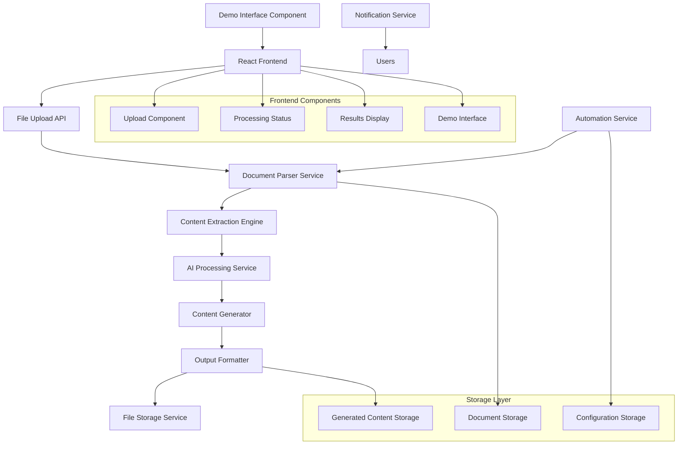

# Design Document

## Overview

The SOP Processor system is a document processing and training content generation platform that transforms Standard Operating Procedure documents into comprehensive training materials. The system uses natural language processing, document parsing, and content generation techniques to automatically create structured summaries, step-by-step training content, evaluation questions, and presentation materials.

## Architecture

The system follows a modular architecture with a React frontend and Node.js backend services:



### Frontend Architecture (React)
The React frontend will consist of several key components:
- **App Component:** Main application container
- **FileUpload Component:** Handles document upload with drag-and-drop
- **ProcessingStatus Component:** Shows real-time processing progress
- **ResultsDisplay Component:** Displays generated content in organized tabs
- **DemoInterface Component:** Provides interactive demo functionality
- **AutomationConfig Component:** Allows configuration of automation settings

## Components and Interfaces

### 1. Document Parser Service
**Purpose:** Handles file upload and text extraction from various document formats

**Key Features:**
- PDF text extraction using libraries like PyPDF2 or pdfplumber
- Text file processing with encoding detection
- File validation and size limit enforcement
- Metadata extraction (document structure, headings, etc.)

**Interface:**
```javascript
// DocumentParser class with methods
class DocumentParser {
  async parseDocument(file) {
    // Returns parsed document object
  }
  
  validateFile(file) {
    // Returns validation result object
  }
  
  extractMetadata(document) {
    // Returns document metadata object
  }
}
```

### 2. Content Extraction Engine
**Purpose:** Analyzes parsed documents to identify key structural elements

**Key Features:**
- Procedure step identification using NLP techniques
- Safety requirement detection through keyword analysis
- Section and heading recognition
- Content hierarchy mapping

**Interface:**
```javascript
// ContentExtractor class with methods
class ContentExtractor {
  extractProcedures(document) {
    // Returns array of procedure objects
  }
  
  identifySafetyRequirements(document) {
    // Returns array of safety requirement objects
  }
  
  mapContentStructure(document) {
    // Returns content structure object
  }
}
```

### 3. AI Processing Service
**Purpose:** Leverages language models for content understanding and generation

**Key Features:**
- Integration with OpenAI GPT or similar LLM APIs
- Prompt engineering for SOP-specific content generation
- Content summarization and restructuring
- Question generation based on content analysis

**Interface:**
```javascript
// AIProcessor class with methods
class AIProcessor {
  async generateSummary(content) {
    // Returns summary object
  }
  
  async createTrainingSteps(procedures) {
    // Returns array of training step objects
  }
  
  async generateQuestions(content, count) {
    // Returns array of question objects
  }
}
```

### 4. Content Generator
**Purpose:** Orchestrates the creation of all output materials

**Key Features:**
- Summary generation with structured formatting
- Step-by-step training content creation
- Evaluation question generation (3-5 questions)
- Learning objective creation

**Interface:**
```javascript
// ContentGenerator class with methods
class ContentGenerator {
  async generateAllContent(document) {
    // Returns complete generated content object
  }
  
  createSummary(extractedContent) {
    // Returns summary object
  }
  
  buildTrainingMaterial(procedures) {
    // Returns training material object
  }
  
  createEvaluation(content) {
    // Returns evaluation object
  }
}
```

### 5. Output Formatter
**Purpose:** Converts generated content into various presentation formats

**Key Features:**
- Slide presentation generation (PowerPoint/Google Slides format)
- HTML/CSS formatting for web display
- PDF generation for printable materials
- Video script generation for automated video creation

**Interface:**
```javascript
// OutputFormatter class with methods
class OutputFormatter {
  async createSlidePresentation(content) {
    // Returns presentation object
  }
  
  formatForWeb(content) {
    // Returns HTML content object
  }
  
  async generatePDF(content) {
    // Returns PDF document object
  }
}
```

### 6. Automation Service
**Purpose:** Monitors folders and triggers automated processing

**Key Features:**
- Google Drive API integration for cloud folder monitoring
- Local file system watching capabilities
- Workflow orchestration and scheduling
- Error handling and retry mechanisms

**Interface:**
```javascript
// AutomationService class with methods
class AutomationService {
  configureWatcher(folderPath, settings) {
    // Configures folder monitoring
  }
  
  async processNewDocument(filePath) {
    // Returns processing result object
  }
  
  createOutputFolder(documentName) {
    // Returns folder path string
  }
  
  notifyCompletion(result) {
    // Sends completion notifications
  }
}
```

### 7. File Storage Service
**Purpose:** Manages document storage and organized output creation

**Key Features:**
- Hierarchical folder structure creation
- File naming conventions and organization
- Version control for generated content
- Cleanup and archival policies

## Data Models

### ParsedDocument
```javascript
// ParsedDocument object structure
const parsedDocument = {
  id: 'string',
  filename: 'string',
  content: 'string',
  metadata: {}, // DocumentMetadata object
  structure: {}, // ContentStructure object
  createdAt: new Date()
}
```

### GeneratedContent
```javascript
// GeneratedContent object structure
const generatedContent = {
  summary: {}, // Summary object
  trainingMaterial: {}, // TrainingMaterial object
  evaluation: {}, // Evaluation object
  sourceDocument: {}, // ParsedDocument object
  generatedAt: new Date()
}
```

### TrainingMaterial
```javascript
// TrainingMaterial object structure
const trainingMaterial = {
  title: 'string',
  learningObjectives: [], // Array of strings
  steps: [], // Array of TrainingStep objects
  estimatedDuration: 0 // Number in minutes
}
```

### Evaluation
```javascript
// Evaluation object structure
const evaluation = {
  questions: [], // Array of Question objects
  passingScore: 0, // Number (percentage)
  instructions: 'string'
}
```

## Error Handling

### File Processing Errors
- **Invalid file format:** Return clear error message with supported formats
- **Corrupted files:** Implement file integrity checks and graceful failure
- **Size limit exceeded:** Enforce limits with informative error messages
- **Extraction failures:** Fallback mechanisms for partial content recovery

### AI Processing Errors
- **API rate limits:** Implement exponential backoff and queuing
- **Content generation failures:** Retry mechanisms with different prompts
- **Quality validation:** Content quality checks before output generation

### Automation Errors
- **Folder access issues:** Permission validation and error reporting
- **Processing failures:** Comprehensive logging and notification system
- **Network connectivity:** Offline mode and retry capabilities

## Testing Strategy

### Unit Testing
- Document parser validation with various file formats
- Content extraction accuracy testing
- AI prompt effectiveness validation
- Output format generation testing

### Integration Testing
- End-to-end workflow testing from upload to output generation
- Automation service integration with file systems
- API integration testing with external services

### Performance Testing
- Large document processing performance
- Concurrent processing capabilities
- Memory usage optimization
- Response time benchmarking

### User Acceptance Testing
- Demo interface functionality validation
- Generated content quality assessment
- Automation workflow reliability testing
- User experience and interface usability

## Security Considerations

### Data Privacy
- Secure document storage with encryption
- API key management for external services
- User access control and authentication
- Data retention and deletion policies

### File Security
- File type validation and sanitization
- Malware scanning for uploaded documents
- Secure temporary file handling
- Access logging and audit trails