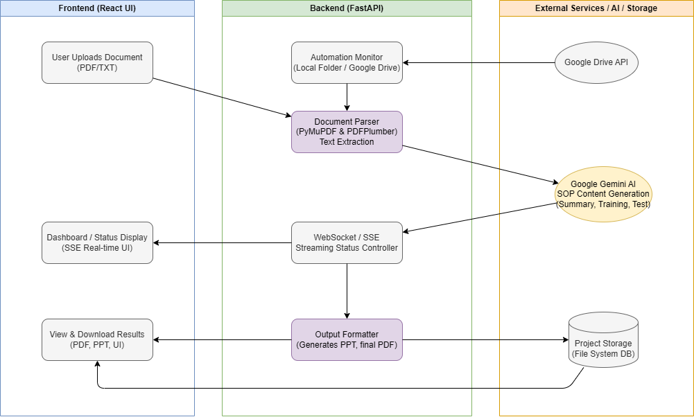
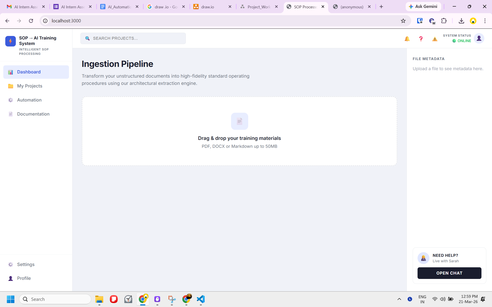
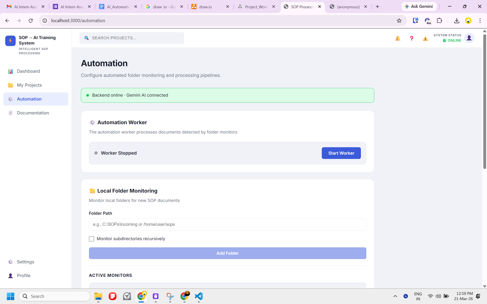
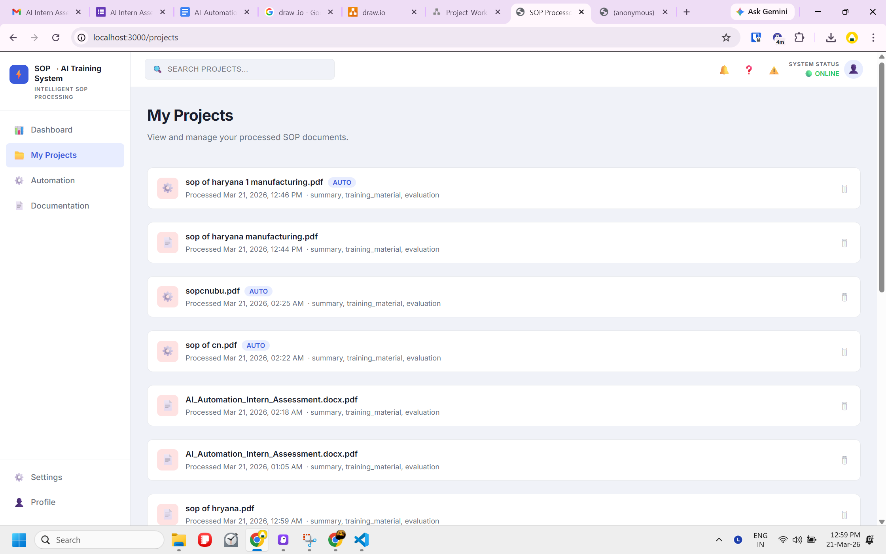

# SOP Processor

AI-powered system that transforms Standard Operating Procedure documents into comprehensive training materials using Google Gemini AI.

## System Architecture & Process Flow



The system follows a comprehensive three-tier architecture:

### Frontend (React UI)
- **User Upload Interface**: Drag & drop document upload (PDF/TXT)
- **Real-time Dashboard**: Live processing status with SSE streaming
- **Results Viewer**: Interactive display of generated content (PDF, PPT, UI)

### Backend (FastAPI)
- **Automation Monitor**: Watches local folders and Google Drive for new documents
- **Document Parser**: Advanced text extraction using PyMuPDF & PDFPlumber
- **WebSocket/SSE Controller**: Real-time status streaming to frontend
- **Output Formatter**: Generates presentations and final PDFs

### External Services / AI / Storage
- **Google Drive API**: Cloud document monitoring and synchronization
- **Google Gemini AI**: SOP content generation (Summary, Training, Test)
- **Project Storage**: File system database for processed documents

## Application Screenshots

### Dashboard - Document Processing Interface

*Main ingestion pipeline where users upload documents and see real-time processing status*

### Automation - Folder Monitoring Setup

*Configure automated folder monitoring and processing pipelines for hands-free operation*

### Output Results - Generated Content

*View processed results with generated summaries, training materials, and evaluation content*

## Features

### Document Processing
- Upload and parse SOP documents (PDF, TXT formats)
- Advanced PDF text extraction with image and table detection
- Real-time streaming processing with progressive results display
- Industry-aware content analysis and generation

### AI-Powered Content Generation
- Comprehensive document summaries with key insights
- Step-by-step training materials with learning objectives
- Evaluation questions and assessments
- Industry-specific terminology and scenarios
- Context-aware safety and compliance emphasis

### Automation & Monitoring
- Folder monitoring for automatic document processing
- Google Drive integration for cloud document monitoring
- Background processing worker with notification system
- Real-time automation notifications and status updates

### Output & Export
- PowerPoint presentation generation
- PDF document export
- Project management and storage system
- Downloadable training materials

### User Interface
- Modern React-based dashboard
- Real-time processing status with streaming updates
- Project management interface
- Automation configuration panel
- Comprehensive documentation system

## Technical Architecture

### Frontend (React)
- **Framework**: React 18.2.0 with React Router for navigation
- **UI Components**: Custom dashboard, file upload, processing status, results display
- **Real-time Updates**: Server-Sent Events (SSE) for streaming processing results
- **Styling**: Custom CSS with responsive design

### Backend (FastAPI)
- **API Framework**: FastAPI with automatic OpenAPI documentation
- **AI Integration**: Google Gemini AI for content generation
- **Document Processing**: Advanced PDF parsing with pdfplumber and PyMuPDF
- **Automation**: Watchdog for folder monitoring, Google Drive API integration
- **Storage**: File-based project storage with metadata management

### Key Services
- **Document Parser**: Extracts text, images, and tables from PDFs
- **Content Extractor**: Analyzes document structure and identifies key elements
- **AI Processor**: Handles Gemini AI interactions with industry-aware prompting
- **Content Generator**: Orchestrates the complete processing pipeline
- **Automation Service**: Manages folder monitoring and background processing
- **Storage Service**: Handles project persistence and retrieval

## Industry-Aware Processing

The system automatically detects document industry and tailors content generation:

**Supported Industries**:
- Software Development (CI/CD, code quality, deployment)
- Manufacturing (production, quality control, equipment safety)
- Laboratory (sample handling, analytical procedures)
- Healthcare (patient safety, clinical protocols)
- Food Service (food safety, HACCP compliance)
- IT Operations (system reliability, security)
- Construction (site safety, building codes)
- Retail (customer service, loss prevention)

**Industry-Specific Features**:
- Terminology and language appropriate to the domain
- Relevant safety emphasis and compliance requirements
- Role-specific training guidance and scenarios
- Industry-realistic evaluation questions

## Getting Started

### Prerequisites
- Node.js (version 14 or higher)
- Python 3.8 or higher
- Google Gemini API key

### Installation

1. **Clone and install frontend dependencies**:
```bash
npm install
```

2. **Install backend dependencies**:
```bash
cd backend
pip install -r requirements.txt
```

3. **Configure environment**:
```bash
# Copy environment template
cp .env.example .env

# Edit .env and add your Gemini API key
GEMINI_API_KEY=your_api_key_here
```

4. **Start the backend server**:
```bash
cd backend
python main.py
```

5. **Start the frontend development server**:
```bash
npm start
```

6. **Open the application**:
Navigate to [http://localhost:3000](http://localhost:3000)

### Available Scripts

**Frontend**:
- `npm start` - Development server
- `npm test` - Run tests
- `npm run build` - Production build

**Backend**:
- `python main.py` - Start FastAPI server
- `pytest` - Run backend tests

## Dependencies

### Frontend Dependencies
- **React 18.2.0** - UI framework
- **React Router DOM 6.8.0** - Client-side routing
- **Axios 1.3.0** - HTTP client for API requests
- **React Dropzone 14.2.3** - Drag-and-drop file upload
- **React Markdown 10.1.0** - Markdown rendering
- **File Saver 2.0.5** - File download functionality
- **PDF.js 5.5.207** - PDF rendering and processing
- **Tailwind CSS 4.2.2** - Utility-first CSS framework

### Backend Dependencies
- **FastAPI 0.110.0** - Modern Python web framework
- **Uvicorn 0.29.0** - ASGI server
- **Google Generative AI 0.8.3** - Gemini AI integration
- **PDFPlumber 0.11.0** - PDF text extraction
- **PyMuPDF 1.23.26** - Advanced PDF processing
- **Python-PPTX 0.6.23** - PowerPoint generation
- **ReportLab 4.0.9** - PDF generation
- **Watchdog 4.0.0** - File system monitoring
- **Google API Client** - Google Drive integration
- **Pytest 8.0.0** - Testing framework

## API Endpoints

### Document Processing
- `POST /api/parse` - Parse document without AI processing
- `POST /api/process` - Full processing pipeline with streaming
- `GET /api/health` - System health check

### Project Management
- `GET /api/projects` - List all processed projects
- `GET /api/projects/{id}` - Get specific project
- `DELETE /api/projects/{id}` - Delete project

### Output Generation
- `POST /api/generate-presentation` - Create PowerPoint presentation
- `POST /api/generate-pdf` - Generate PDF document

### Automation
- `POST /api/automation/configure-watcher` - Set up folder monitoring
- `DELETE /api/automation/watcher/{id}` - Stop folder monitoring
- `GET /api/automation/watchers` - List active watchers
- `POST /api/automation/start-worker` - Start background processing
- `POST /api/automation/stop-worker` - Stop background processing
- `GET /api/automation/notifications` - Get automation notifications

### Google Drive Integration
- `POST /api/automation/google-drive/add-folder` - Monitor Drive folder
- `DELETE /api/automation/google-drive/folder/{id}` - Stop Drive monitoring
- `GET /api/automation/google-drive/status` - Drive monitoring status

## Processing Pipeline

1. **Document Upload** - User uploads PDF or text file
2. **Parsing** - Extract text, images, and structure
3. **Content Analysis** - Industry detection and comprehensive extraction
4. **AI Processing** - Generate summary, training, and evaluation content
5. **Storage** - Save results as project
6. **Export** - Generate presentations and documents

## Streaming Processing

The system uses Server-Sent Events (SSE) for real-time processing updates:

1. **Status Updates** - "Parsing document...", "Generating summary..."
2. **Progressive Results** - Summary appears first, then training, then evaluation
3. **Error Handling** - Real-time error reporting
4. **Completion** - Final project ID and storage confirmation

## Automation Features

### Folder Monitoring
- Watch local folders for new SOP documents
- Configurable file patterns and recursive monitoring
- Automatic processing of new files
- Desktop notifications for results

### Google Drive Integration
- Monitor specific Google Drive folders
- Automatic download and processing of new documents
- Support for multiple folder monitoring
- OAuth authentication for secure access

### Background Processing
- Queue-based processing system
- Concurrent document handling
- Error recovery and retry logic
- Real-time notification system

## Project Structure

```
├── backend/                    # FastAPI backend
│   ├── main.py                # API server and endpoints
│   ├── models.py              # Pydantic data models
│   ├── document_parser.py     # PDF/text parsing
│   ├── content_extractor.py   # Document analysis
│   ├── content_generator.py   # Content generation pipeline
│   ├── ai_processor.py        # Gemini AI integration
│   ├── automation_service.py  # Folder monitoring
│   ├── storage_service.py     # Project storage
│   ├── output_formatter.py    # Export generation
│   └── requirements.txt       # Python dependencies
├── src/                       # React frontend
│   ├── components/            # Reusable UI components
│   │   ├── FileUpload.js     # Drag-and-drop upload
│   │   ├── ProcessingStatus.js # Real-time status
│   │   ├── ResultsDisplay.js  # Content display
│   │   └── AutomationConfig.js # Automation setup
│   ├── pages/                 # Application pages
│   │   ├── Dashboard.js       # Main processing interface
│   │   ├── MyProjects.js      # Project management
│   │   ├── Automation.js      # Automation control
│   │   └── Settings.js        # Configuration
│   ├── services/              # Business logic
│   │   ├── apiService.js      # API communication
│   │   ├── DocumentParser.js  # Frontend parsing
│   │   ├── ContentGenerator.js # Content handling
│   │   └── FileStorageService.js # Storage management
│   └── App.js                 # Main application
├── public/                    # Static assets
├── .env.example              # Environment template
└── README.md                 # This file
```

## License

This project is for Internship task given by Nutrabay